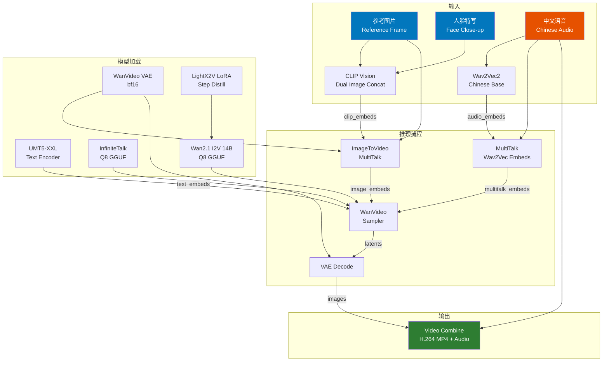

# InfiniteTalk ComfyUI Workflow — 中文语音驱动口型同步视频生成

基于 [InfiniteTalk](https://github.com/AIMMLab/InfiniteTalk) + [ComfyUI-WanVideoWrapper](https://github.com/kijai/ComfyUI-WanVideoWrapper) 的中文语音驱动口型同步视频生成工作流。

输入一张参考图片 + 一段中文语音，即可生成 40 秒以上的口型同步说话视频。本工作流经过多轮参数调优，可在 32GB 显存（如 RTX 5090）上稳定运行。以下 Demo 以春节拜年场景为例。

## 演示结果

<table>
<tr>
<td>

https://github.com/user-attachments/assets/afaf152e-ba62-498d-a5d3-8872f8cbf32e

</td>
<td>

https://github.com/user-attachments/assets/93cc96a8-59a2-421c-a7e0-71a4067926d8

</td>
</tr>
<tr>
<td>

https://github.com/user-attachments/assets/5d760e2a-ee8c-441f-9965-3b0c5f61898d

</td>
<td>

https://github.com/user-attachments/assets/38de67ae-1bd0-4434-b9cd-881f0dfc8819

</td>
</tr>
</table>

## 工作流架构



## 关键参数

| 参数 | 值 | 说明 |
|------|-----|------|
| I2V 模型 | `wan2.1-i2v-14b-480p-Q8_0.gguf` | Q8 量化，17GB |
| InfiniteTalk 模型 | `Wan2_1-InfiniteTalk_Single_Q8.gguf` | Q8 量化，2.5GB |
| base_precision | `bf16` | 基础精度 |
| LoRA | `lightx2v` step distill, strength=1.0 | 加速推理，4步即可 |
| merge_loras | `False` | Q8 GGUF 必须用 on-the-fly 模式 |
| quantization | `disabled` | GGUF 已量化，无需再量化 |
| block_swap | 20 | 适配 32GB 显存 |
| attention_mode | `sageattn` | SageAttention 加速 |
| CLIP combine_embeds | `concat` | 双图拼接（参考帧 + 人脸特写） |
| tiles / ratio | 4 / 0.5 | CLIP 编码分块参数 |
| sampler | `unipc`, 4 steps, cfg=1.0, shift=11.0 | 蒸馏 LoRA 下的采样配置 |
| frame_window_size | 81 | 滑动窗口大小 |
| motion_frame | 9 | 运动帧数 |
| audio_scale | 1.5 | 音频驱动强度 |
| num_frames | `duration × 25 + 1` | 自动根据音频时长计算 |

## 调优历程

在最终确定当前方案之前，我们测试了多组参数组合：

| 版本 | 变更 | 结果 |
|------|------|------|
| V1 | 基线：fp8 scaled I2V, image_2=参考帧, average, tiles=1 | 口型不同步，画面模糊 |
| V2 | image_2=人脸特写, concat, tiles=4, ratio=0.5, motion_frame=9 | **效果最佳**（后续基于此优化） |
| V3 | colormatch=adain | 色彩偏移，不如 disabled |
| V4 | motion_frame=15 | 动作过大，不自然 |
| V5 | audio_scale=2.0 | 口型夸张 |
| V6 | cfg=2.0 | 画面过度锐化 |
| V7 | steps=8 | 速度减半，质量提升不明显 |
| **当前** | V2 基础上 I2V/IT 换 Q8 GGUF, base_precision=bf16 | 效果与 V2 一致，兼容性更好 |

## 分辨率与显存

| 分辨率 | 32GB 显存 (block_swap=20) | 说明 |
|--------|--------------------------|------|
| 464×832 | ✅ 稳定运行 | 推荐，9:16 竖屏 |
| 624×624 | ✅ 稳定运行 | 1:1 方形 |
| 720×1280 | ⚠️ 可运行但较慢 | 像素量大，生成速度慢 |
| 1080×1080 | ❌ shape 不匹配报错 | 超出模型支持范围 |
| 1080×1920 | ❌ OOM | 显存不足 |

> 如果使用 80GB 显存（如 A800/H800），可将 `block_swap` 设为 0，速度会显著提升。

## 环境要求

- [ComfyUI](https://github.com/comfyanonymous/ComfyUI) >= 0.8.2
- [ComfyUI-WanVideoWrapper](https://github.com/kijai/ComfyUI-WanVideoWrapper)（含 InfiniteTalk 支持）
- [ComfyUI-VideoHelperSuite](https://github.com/Kosinkadink/ComfyUI-VideoHelperSuite)
- Python 3.10+, PyTorch 2.x, CUDA
- GPU: 32GB+ 显存（推荐 RTX 5090 / A800 / H800）
- [SageAttention](https://github.com/thu-ml/SageAttention)（可选，加速推理）

## 模型下载

| 模型 | 路径 | 来源 |
|------|------|------|
| Wan2.1 I2V 14B Q8 | `models/diffusion_models/WanVideo/I2V/` | [Kijai/WanVideo_comfy](https://huggingface.co/Kijai/WanVideo_comfy) |
| InfiniteTalk Single Q8 | `models/diffusion_models/WanVideo/InfiniteTalk/` | [Kijai/WanVideo_comfy](https://huggingface.co/Kijai/WanVideo_comfy) |
| Wan2.1 VAE bf16 | `models/vae/` | [Kijai/WanVideo_comfy](https://huggingface.co/Kijai/WanVideo_comfy) |
| UMT5-XXL bf16 | `models/text_encoders/` | [Kijai/WanVideo_comfy](https://huggingface.co/Kijai/WanVideo_comfy) |
| CLIP Vision H | `models/clip_vision/` | [Kijai/WanVideo_comfy](https://huggingface.co/Kijai/WanVideo_comfy) |
| Wav2Vec2 Chinese Base fp16 | `models/wav2vec2/` | [Kijai/WanVideo_comfy](https://huggingface.co/Kijai/WanVideo_comfy) |
| LightX2V LoRA | `models/loras/` | [Kijai/WanVideo_comfy](https://huggingface.co/Kijai/WanVideo_comfy) |

## 快速开始

### 1. 准备输入文件

将以下文件放入 ComfyUI 的 `input/` 目录：
- 参考图片：从参考视频中提取的第一帧（PNG）
- 人脸特写：从参考视频中裁剪的人脸区域（PNG）
- 参考视频：目标人物的视频素材
- 中文语音：WAV 格式音频文件

> 参考音频可以通过 [GPT-SoVITS](https://www.autodl.art/i/RVC-Boss/GPT-SoVITS/GPT-SoVITS-Official/761/24) 基于目标人物的语音素材训练后生成。参考人脸图片和参考视频则需要自行准备目标人物的素材。

### 2. 修改配置

编辑 `run_infinitetalk_batch.py` 中的 `VIDEOS` 和 `AUDIO_FILES`：

```python
VIDEOS = [
    {"name": "my_video", "frame": "my_frame.png", "face": "my_face.png", "w": 464, "h": 832},
]

AUDIO_FILES = [
    "my_audio.wav",
]
```

### 3. 运行

```bash
# 确保 ComfyUI 已启动
python run_infinitetalk_batch.py --comfyui-input /path/to/ComfyUI/input
```

输出视频将保存在 ComfyUI 的 `output/` 目录。

## 项目结构

```
.
├── README.md
├── run_infinitetalk_batch.py    # 批量生成脚本
└── workflow/
    └── workflow_api.json        # ComfyUI API 格式工作流
```

## 致谢

- [InfiniteTalk](https://github.com/AIMMLab/InfiniteTalk) — 音频驱动的无限时长说话人视频生成
- [ComfyUI-WanVideoWrapper](https://github.com/kijai/ComfyUI-WanVideoWrapper) — ComfyUI 中的 WanVideo 集成
- [Wan2.1](https://github.com/Wan-Video/Wan2.1) — 万象视频生成模型
- [LightX2V](https://github.com/ModelTC/lightx2v) — 视频生成加速

## 免责声明

本项目仅供技术研究和学习交流使用。Demo 中使用的人物肖像素材来源于公开网络，仅作为技术演示用途，不代表任何商业用途或对相关人物的任何暗示。

使用者应自行承担使用本工作流生成内容的法律责任，包括但不限于：
- 未经授权使用他人肖像可能侵犯肖像权
- 生成虚假或误导性内容可能违反相关法律法规
- 请勿将生成内容用于欺诈、诽谤或其他非法目的

如有侵权，请联系删除。

## License

MIT
